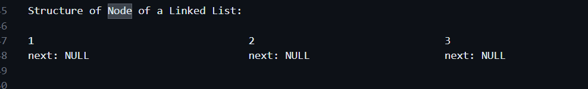

# Linked List

## theory

Use Case:
- distributed memory / increase and decrease size

Nodes Connected With Each Other:

A -----> B -----> C -----> D

1 GB    1 GB     1 GB     1 GB

A -> next = B
B -> next = C
C -> next = D

In Real Life:

Linked List -----> Rise to Distributed Memory

Distributed Memory -----> Distributed Systems ------> Monolith to Microservice Structure

Product: AWS(Webapp, Android, iOS), Netapp, Linkedin, Instagram

## Node :
class Node
{
	int data;
	Node next = null; // Self Referential Object

	Node(int data)
	{
		this.data = data;
	}
}

IMP: Every Node will have EXACT SAME Structure

{
	data: int
	next: NULL
}

{
	data: int
	next: NULL
}

{
	data: int
	next: NULL
}

{
	data: int
	next: NULL
}

{
	data: int
	next: NULL
}
## Create a simple node 
ListNode head = new ListNode(1);
		ListNode a = new ListNode(2);
		ListNode b = new ListNode(3);
		ListNode c = new ListNode(4);
		ListNode d = new ListNode(5);
		
		head.next=a;
		a.next=b;
		b.next=c;
		c.next=d;

		
### PROBLEMS

## 1. TRAVERSAL: Printing Linked List
head: 1 -> 2 -> 3 -> 4 -> 5 -> null
OP: [1 2 3 4 5]

void printList(Node head)
{
	Node temp = head; // Dummy Node
	while(temp!= null) 
	{
		System.out.print(temp.data +  " ");
		temp = temp.next;
	}
}

OP: [1 2 3 4 5]

TC: O(N)
SC: O(1)

## 2. [Amazon] Count the Number of Nodes in a LL/ Length of LL 
head: 1 -> 2 -> 3 -> 4 -> 5 -> null
OP: 5

int lengthofLL(Node head)
{
	Node temp = head; // Dummy Node
	int length = 0;

	while(temp!= null) 
	{
		++length;
		temp = temp.next;
	}

	return length;
}

TC: O(N)
SC: O(1)

## 3. [Adobe] Search in a Linked List
LL, int key
head: 1 -> 2 -> 3 -> 4 -> 5 -> null
IP: 2
OP: true
IP: 7
OP: false

boolean searchinLL(Node head, int key)
{
	Node temp = head;

	while(temp!=null)
	{
		if (temp.data == key)
			return true;

		temp = temp.next;
	}

	return false;
}

Brownie Points

TC: Best Case: O(1) - First Node
	Worst Case: O(N) - Last Node/ Node Not Present

SC: O(1)

## 4. Q-4: [Microsoft] Print Kth Node from Beginning in a Linked List
LL, int K
head: 10 -> 20 -> 30 -> 40 -> 50 -> null
K = 2
OP: 20
K = 4
OP: 40

int KthNode(Node head, int K)
{
	Node temp = head; // Dummy Node
	int count = 0;
	
	while(temp!= null) 
	{
		++count;

		if (count == K)
			return temp.data;

		temp = temp.next;
	}

	return -1;
}

## VVVVVVI 
## Q-5: Kth Node from End in a Linked List: SPECIAL
[Google, Cisco, Adobe, Paypal, Flipkart]
LL, int K
head: 10 -> 20 -> 30 -> 40 -> 50 -> null
K = 1
OP: 50
K = 4
OP: 20

#### Approach:

Initial:

slow = head
fast = head + K

Start Traversal:
(Move Both by 1 Step - Same Speed)

slow = slow.next
fast = fast.next

fast == null: STOP
slow -> Kth Node from End

TC: O(N)
SC: O(1)

### DRY RUN:

head: 10 -> 20 -> 30 -> 40 -> 50 -> null

K = 2
OP: 40

head = 10

Initial: 

slow = 10
fast = head + K = 30

Start Traversal:

slow = 10->20
fast = 30->40

slow = 20->30
fast = 40->50

slow = 30->40: Kth Node from End
fast = 50->null: STOP
OP: 40

int KthNodefromEnd(Node head, int K)
{

	Node slow = head;
	Node fast = head;

	while(K!=0)   // O(K)
	{
		fast = fast.next;
		K--;
	}

	while(fast!=null) // O(N-K)
	{
		slow = slow.next;
		fast = fast.next;
	}

	// After while loop, fast points to null, slow points to Kth Node from End
	return slow.data;
}

TC: O(N)
SC: O(1)

## VVVVVVI
## Q-6: Middle of Linked List: SPEICAL
[Paypal, Adobe]

head: 10 -> 20 -> 30 -> 40 -> 50 -> null
Middle: 30: OP

[LC-876] Middle of the Linked List
https://leetcode.com/problems/middle-of-the-linked-list/

Given the head of a singly linked list, return the middle node of the linked list.

If there are two middle nodes, return the second middle node. 

Example 1:

Input: head = [1,2,3,4,5]
Output: [3,4,5]
Explanation: The middle node of the list is node 3.

Example 2:

Input: head = [1,2,3,4,5,6]
Output: [4,5,6]
Explanation: Since the list has two middle nodes with values 3 and 4, we return the second one.

### Approach:

Initial: 

slow = head
fast = head

During Traversal:

slow = slow.next
fast = fast.next.next

When the fast reaches the End, (fast!=null || fast.next!=null)
Slow -> Middle of Linked List

### DRY RUN:
head: 10 -> 20 -> 30 -> 40 -> 50 -> null

len: 5
Middle: 30

head = 10

Initial:

slow = 10
fast = 10

Start Traversal:

slow = 10->20
fast = 10->20->30

slow = 20->30: ANS
fast = 30->40->50: END

OP: 30

class Solution 
{   
    public ListNode middleNode(ListNode head) 
    {
        ListNode slow = head;
        ListNode fast = head;
        
        // Contains 0 or 1 Number of Nodes
        if (head == null || head.next == null)
            return head;

       // while(fast.next!=null && fast.next.next!=null)
        // returns first middle node
        
        // fast should not be null OR Last Node - returns second middle node
        while(fast!=null && fast.next!=null)
        {
            slow = slow.next; // O(1)
            fast = fast.next.next; // O(1)          
        }
        
        return slow;
    }
}

TC: O(N/2)
SC: O(1)