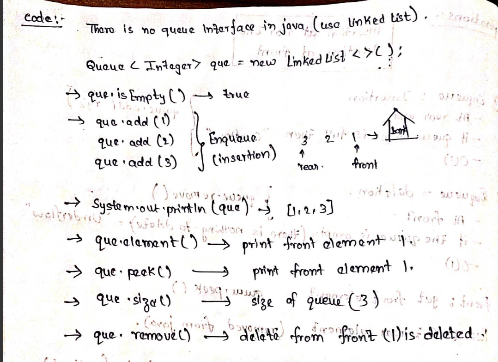

# Queues

## theory

Use Case:
- Least Recently Used Element in O(1) Time

FIFO Order:
- First In First Out 
- First come First servered

Real Life Example:
- People standing in a que in a bank

People standing in a que :
----Rear-------------first   

whoever comes to bank has to stand next to rear and 
if the first person completes his work he is moved out from the que(deleted)

## Application : 
insertion happens at rear end
deletion happens at front 

TC: O(1): Constant Time

Not Dependent upon Queue Size

________________________________________________________________________________________________________________________

## Operations -

Insertion: Rear
Deletion: Front

1.  Enqueue: Insertion
- At Rear

If Queue == Full
"Overflow"

TC: O(1)

2.  Dequeue: Deletion 
- At Front

If Queue == Empty
"Underflow"

TC: O(1)

3. Front: Get Front Element

4. Rear: Get Rear Element

5. queue.isEmpty() - true/false
Empty or Not

boolean isEmpty()
{
    return (q.front() == null);
}

TC: O(1)  

____________________________________________________________________________________________________________________________

## Applications:

(1) LRU Cache: L1/L2/L3

[F: 1 2 3 4 5: R]

(2) OS:

CPU Scheduling:

CPU: Threads for Tasks ----> Queues (FCFS/FIFO)

Why Queues, Not Stacks?

Login to your PC:

4 Operations: [Chrome, VLC, Spotify, VS Code]

Queue: [Chrome, VLC, Spotify, VS Code]

Stacks: [VS Code, Spotify, VLC, Chrome]

- Queue is Used

(3) input output Buffers

Buffer Size and Time for Submission

Time -----> Rank
Less Time ----> Less Rank

time_stamp: Stored in Queue (Along With metadata)

Based upon tim_stamp: Rank is Generated

1st Submission: Rank 1
2nd Submission: Rank 2
................

Submitted First -----> Rank 1 ----> Queue

Submitted Last -----> Rank 1 ----> Stack

_____________________________________________________________________________________________________________________________

## Code :
